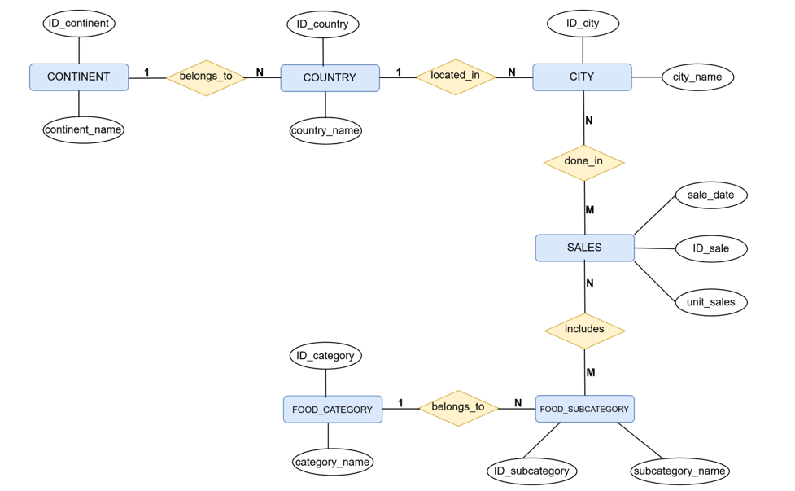
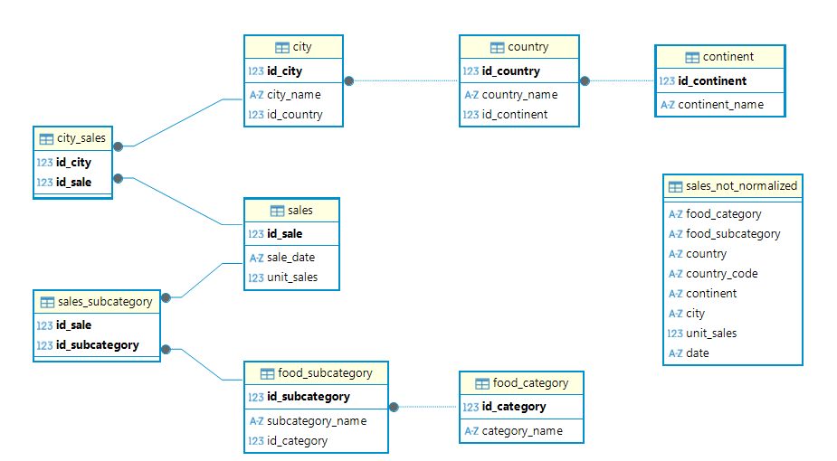
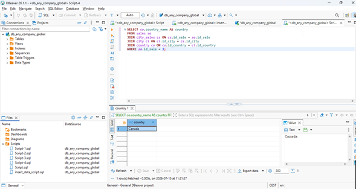
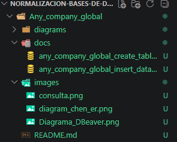

# Ejercicio 2: Any Company Global - Normalización de Bases de Datos

## Descripción del ejercicio

Este ejercicio parte de una tabla sin normalizar con información de ventas de productos por ciudad, país y continente, portanto se debe crear la base de datos en DBeaver, normalizar con entidades y relaciones.


## Tabla original (sin normalizar)

Tabla `sales_not_normalized`, con 10 filas de ventas:

| date | food_category | food_subcategory | country | country_code | continent | city | unit_sales |
|---|---|---|---|---|---|---|---|
| 2021-10-06 | Beverages | Carbonated non-alcoholic | Belgium | BEL | Europe | Brussels | 1906983 |
| 2021-10-13 | Dairy | Low-fat milk | Brazil | BRA | South America | Rio de Janeiro | 652432000 |
| 2021-11-10 | Meats, eggs, and nuts | Nuts and seeds raw | Canada | CAN | North America | Vancouver | 354097000 |
| 2021-11-24 | Fruits | Fruit juice | Germany | DEU | Europe | Berlin | 132004000 |
| 2021-12-07 | Commercially prepared items | Packaged nuts | Denmark | DNK | Europe | Copenhagen | 80125000 |
| 2021-12-15 | Fruits | Canned fruit juice | France | FRA | Europe | Paris | 754945000 |
| 2021-12-22 | Commercially prepared items | Not sweet canned (soups, sauces, and more) | Ireland | IRL | Europe | Dublin | 112873000 |
| 2022-01-07 | Commercially prepared items | Sweet ready-to-eat (bakery items) | United States | USA | North America | Washington D.C. | 90086000 |
| 2022-01-15 | Commercially prepared items | Not sweet packaged, snacks | Uruguay | URY | South America | Montevideo | 140941000 |
| 2022-01-22 | Commercially prepared items | Sweet frozen (ice cream, frozen desserts) | Samoa | WSM | Oceania | Apia | 6000000 |

## Análisis de normalización

Dentro de esta tabla hay dos jerarquías escondidas, con redundancia:

Geografía y producto, ambas cadenas convergen en la entidad `SALES` (cada venta ocurre en una ciudad y corresponde a una subcategoría).


## Diagrama Entidad-Relación de Chen

Seis entidades: `CONTINENT`, `COUNTRY`, `CITY`, `SALES`, `FOOD_SUBCATEGORY`, `FOOD_CATEGORY`. Relaciones `belongs_to` y `located_in` (1:N), y `done_in` / `includes`.



*(Screenshot exportado desde diagrams.net. Fuente editable: `diagramas/chen-er-diagram.drawio`.)*

## Tablas normalizadas (implementadas en DBeaver / SQLite)

| Tabla | Columnas | Notas |
|---|---|---|
| `continent` | id_continent (PK), continent_name | |
| `country` | id_country (PK), country_name, id_continent (FK) | |
| `city` | id_city (PK), city_name, id_country (FK) | |
| `food_category` | id_category (PK), category_name | |
| `food_subcategory` | id_subcategory (PK), subcategory_name, id_category (FK) | |
| `sales` | id_sale (PK), sale_date, unit_sales | |
| `city_sales` | id_city (FK), id_sale (FK) | Tabla puente (M:N ciudad-venta) |
| `sales_subcategory` | id_sale (FK), id_subcategory (FK) | Tabla puente (M:N venta-subcategoría) |

`sales_not_normalized` se conserva intacta como referencia del punto de partida.

## Diagrama de relaciones en DBeaver

Diagrama generado automáticamente por DBeaver.



## Script SQL final

**Output obtenido:** `Canada` ✓ (coincide con el resultado esperado por el ejercicio)



## Estructura de carpetas del ejercicio

ejercicio-2-any-company-global/

├── diagrams/
|    └──chen-er-diagram.drawio
├── docs
|   ├── any_company_global_create_table_script.sql
|   └── any_company_global_insert_data_script.sql
├── images
|   ├──consulta.png
|   ├──diagram_chen.er.png
|   └──Diagrama_Dbeaver.png
└── README.md
 
 

```

## Recursos

- [diagrams.net](https://app.diagrams.net)
- [Normalización de bases de datos - FreeCodeCamp](https://www.freecodecamp.org/espanol/news/normalizacion-de-base-de-datos-formas-normales-1nf-2nf-3nf-ejemplos-de-tablas/)
- DBeaver Community Edition

## Autora

**[Luisa María Cortés](https://github.com/lcortes89)**