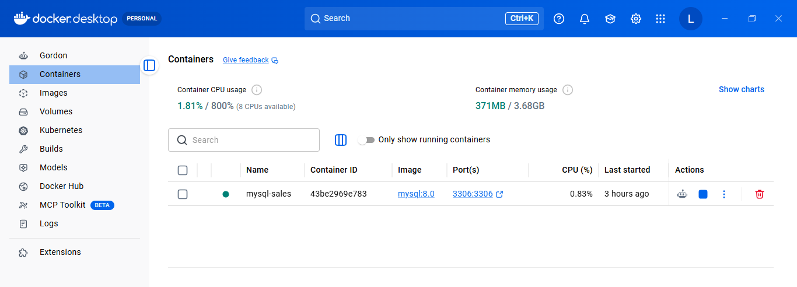

# Ejercicio 3: Análisis de Ventas con SQL en Docker (MySQL)

🔗 [Ver este repositorio en GitHub](https://github.com/lcortes89/Normalizacion-bases-de-datos/Ejercicio-3-Sales) | ejercicio SQL - Sales.

## Descripción del ejercicio

Este ejercicio parte de una tabla `sales` con información de ventas de productos de alimentación por categoría, subcategoría, país, ciudad y continente. El objetivo es levantar una base de datos MySQL en un contenedor Docker, crear la tabla a partir del script proporcionado y escribir consultas SQL que respondan preguntas concretas sobre los datos.

Requisitos: levantar una base de datos MySQL en Docker, crear en ella la tabla sales a partir del script proporcionado, y escribir cuatro consultas SQL: una para obtener todos los datos de food_category y food_subcategory, otra para filtrar las subcategorías que empiezan por "C", otra para calcular el total de unidades vendidas, y otra para sumar las unidades vendidas del continente americano.

## Tabla original

Tabla `sales`, con 20 filas de ventas (columnas: `date`, `food_category`, `food_subcategory`, `country`, `country_code`, `continent`, `city`, `unit_sales`). Muestra de las primeras filas:

| date | food_category | food_subcategory | country | country_code | continent | city | unit_sales |
|---|---|---|---|---|---|---|---|
| 2024-01-05 | Fruits | Apples | Spain | ES | Europe | Madrid | 120 |
| 2024-01-06 | Fruits | Bananas | Spain | ES | Europe | Barcelona | 95 |
| 2024-01-13 | Meat | Chicken | United States | US | North America | New York | 220 |
| 2024-01-19 | Beverages | Soda | Brazil | BR | South America | São Paulo | 260 |
| 2024-01-21 | Grains | Rice | Japan | JP | Asia | Tokyo | 320 |

## Base de datos MySQL en Docker

Se levantó un contenedor Docker con la imagen oficial de MySQL 8.0:

```bash
docker run --name mysql-sales -p 3306:3306 -e MYSQL_ROOT_PASSWORD=<45678**> -d mysql:8.0
```

Verificación de que el contenedor está corriendo:

```bash
docker ps
```



## Conexión y creación de la base de datos

Conexión desde **DBeaver** a `localhost:3306` con usuario `root`. Script de creación de la base de datos y la tabla: [`base/create_database_and_table.sql`](./base/create_table_and_insert_data.sql).

    ![Tabla sales con los 20 registros cargados]

## Scripts de consultas

### 1. Categoría y subcategoría de alimentos

[`script/select_category_subcategory.sql`](./images/query_category_subcategory_result.png)

```sql
SELECT food_category, food_subcategory
FROM sales_db.sales;
```

**Resultado:** 20 filas (todas las categorías y subcategorías de la tabla).


### 2. Subcategorías que empiezan por "C"

[`script/select_subcategories_starting_with_c.sql`](./images/query_subcategories_c_result.png)

```sql
SELECT food_subcategory
FROM sales_db.sales
WHERE food_subcategory LIKE 'C%';
```

**Resultado:** 6 filas — Carrots, Cheese, Croissants, Chicken, Chips, Chocolate.

### 3. Total de unidades vendidas

[`script/total_unit_sales.sql`](./images/query_total_unit_sales_result.png)

```sql
SELECT SUM(unit_sales) AS total_unit_sales
FROM sales_db.sales;
```

**Resultado:** 3.885 unidades vendidas en total.

### 4. Unidades totales del continente americano

[`script/total_units_american_continent.sql`](./script/query_total_american_units_result.png)

```sql
SELECT SUM(unit_sales) AS total_american_units
FROM sales_db.sales
WHERE continent LIKE '%America%';
```

**Resultado:** 1.785 unidades (Norteamérica + Sudamérica).

## Estructura de carpetas del repositorio

```
sql-sales-analysis/
├── base/
│   └── create_table_and_insert_data.sql
├── script/
│   ├── Script1_food_category_subcategory.sql
│   ├── Script2_subcategories_letter_c.sql
│   ├── Script3_total_units_sold.sql
│   └── Script4_total_units_america.sql
├── images/
│   ├── docker_container_running.png
│   ├── sales_table_data.png
│   ├── query_category_subcategory_result.png
│   ├── query_subcategories_c_result.png
│   ├── query_total_unit_sales_result.png
│   └── query_total_american_units_result.png
└── README.md
```

## Cómo reproducir el proyecto

### Requisitos previos

- [Docker Desktop](https://www.docker.com/products/docker-desktop/) instalado y en ejecución
- [DBeaver](https://dbeaver.io/download/) instalado
- [Git](https://git-scm.com/downloads) para clonar el repositorio


## Recursos

- [W3Schools SQL Tutorial](https://www.w3schools.com/sql/) — recurso indicado en el enunciado del ejercicio
- [MySQL 8.0 Reference Manual](https://dev.mysql.com/doc/refman/8.0/en/)
- [Docker Docs — Get started](https://docs.docker.com/get-started/)
- DBeaver Community Edition

## Autora

**[Luisa María Cortés](https://github.com/lcortes89)**
