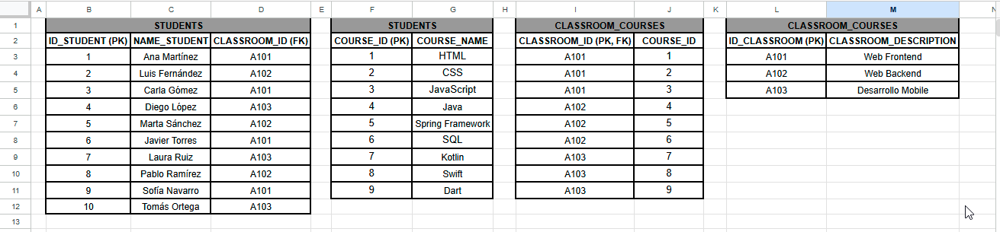
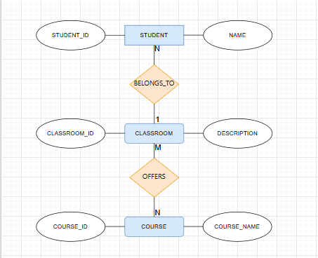
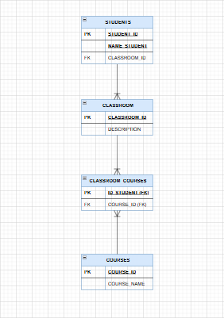
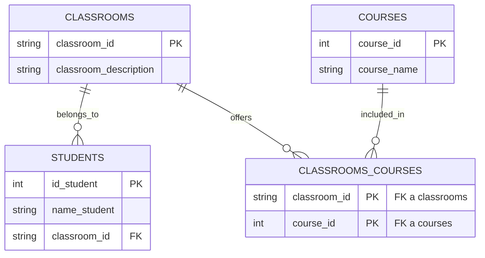

# Ejercicio 1: Students-Classrooms-Courses - Normalización de Bases de Datos

## Repositorio

🔗 [Ver este repositorio en GitHub](https://github.com/lcortes89/Normalizacion-bases-de-datos) | ejercicio del módulo de Normalización de Bases de Datos.

## Descripción del ejercicio

Todo parte de una tabla sin normalizar con información de alumnos, aulas y cursos donde el objetivo es:

1. Normalizar la tabla original (eliminar redundancia y grupos repetidos).
2. Construir un diagrama Entidad-Relación de Chen (modelo conceptual).
3. Construir un diagrama de base de datos en notación de patas de gallo (modelo físico), con tablas, campos, tipos de dato y relaciones.
4. Documentar todo en este README.

## Tabla original (sin normalizar)

| ID_STUDENT | NAME_STUDENT | CLASSROOM | CLASSROOM_DESCRIPTION | COURSE1 | COURSE2 | COURSE3 |
|---|---|---|---|---|---|---|
| 1 | Ana Martínez | A101 | Web Frontend | HTML | CSS | JavaScript |
| 2 | Luis Fernández | A102 | Web Backend | Java | Spring Framework | SQL |
| 3 | Carla Gómez | A101 | Web Frontend | HTML | CSS | JavaScript |
| 4 | Diego López | A103 | Desarrollo Mobile | Kotlin | Swift | Dart |
| 5 | Marta Sánchez | A102 | Web Backend | Java | Spring Framework | SQL |
| 6 | Javier Torres | A101 | Web Frontend | HTML | CSS | JavaScript |
| 7 | Laura Ruiz | A103 | Desarrollo Mobile | Kotlin | Swift | Dart |
| 8 | Pablo Ramírez | A102 | Web Backend | Java | Spring Framework | SQL |
| 9 | Sofía Navarro | A101 | Web Frontend | HTML | CSS | JavaScript |
| 10 | Tomás Ortega | A103 | Desarrollo Mobile | Kotlin | Swift | Dart |

Esta tabla tiene dos problemas: las columnas COURSE1/COURSE2/COURSE3 son un grupo repetido (viola 1NF), y CLASSROOM_DESCRIPTION se repite una vez por cada alumno del aula en lugar de guardarse una sola vez (redundancia).

## Proceso de normalización

**1NF** — se elimina el grupo repetido de cursos: cada combinación alumno-curso pasa a ser una fila individual en lugar de tres columnas.

**2NF/3NF** — se separan los datos por tema en tablas independientes, de forma que cada atributo dependa únicamente de la clave de su propia tabla: datos de alumno, datos de aula y datos de curso quedan en tablas distintas.

Importante: Los cursos no varían por alumno, varían por aula, por eso la relación muchos-a-muchos se modela entre **CLASSROOM** y **COURSE** ya que el aula ofrece un conjunto de cursos, esto evita guardar la misma asociación aula-curso repetida una vez por cada alumno.

## Tablas normalizadas

**STUDENTS**

| ID_STUDENT | NAME_STUDENT | CLASSROOM_ID |
|---|---|---|
| 1 | Ana Martínez | A101 |
| 2 | Luis Fernández | A102 |
| 3 | Carla Gómez | A101 |
| 4 | Diego López | A103 |
| 5 | Marta Sánchez | A102 |
| 6 | Javier Torres | A101 |
| 7 | Laura Ruiz | A103 |
| 8 | Pablo Ramírez | A102 |
| 9 | Sofía Navarro | A101 |
| 10 | Tomás Ortega | A103 |

**CLASSROOMS**

| CLASSROOM_ID | CLASSROOM_DESCRIPTION |
|---|---|
| A101 | Web Frontend |
| A102 | Web Backend |
| A103 | Desarrollo Mobile |

**COURSES**

| COURSE_ID | COURSE_NAME |
|---|---|
| 1 | HTML |
| 2 | CSS |
| 3 | JavaScript |
| 4 | Java |
| 5 | Spring Framework |
| 6 | SQL |
| 7 | Kotlin |
| 8 | Swift |
| 9 | Dart |

**CLASSROOMS_COURSES** (tabla puente que resuelve la relación muchos-a-muchos entre aulas y cursos)

| CLASSROOM_ID | COURSE_ID |
|---|---|
| A101 | 1 |
| A101 | 2 |
| A101 | 3 |
| A102 | 4 |
| A102 | 5 |
| A102 | 6 |
| A103 | 7 |
| A103 | 8 |
| A103 | 9 |



## Diagrama Entidad-Relación de Chen

Modelo conceptual: tres entidades (STUDENT, CLASSROOM, COURSE) unidas por dos relaciones — BELONGS_TO (N:1, un alumno pertenece a un aula) y OFFERS (M:N, un aula ofrece varios cursos).



Fuente editable: `./diagrams/chen-er-diagram.drawio` (abrir en [app.diagrams.net](https://app.diagrams.net)).

## Diagrama de base de datos (patas de gallo)



Modelo físico: las 4 tablas reales, con sus columnas, tipos de dato, claves primarias (PK) y foráneas (FK).



Fuente editable: `diagramas/crows-foot-diagram.drawio` (abrir en [app.diagrams.net](https://app.diagrams.net)).

## Archivos de este ejercicio

```
ejercicio-1-students-classrooms-courses/
├── README.md
├── Students-Classrooms-Courses-Normalizado.xlsx
└── diagramas/
    ├── chen-er-diagram.svg
    ├── chen-er-diagram.drawio
    └── crows-foot-diagram.drawio
```

## Recursos

- [diagrams.net](https://app.diagrams.net)
- [Normalización de bases de datos - FreeCodeCamp](https://www.freecodecamp.org/espanol/news/normalizacion-de-base-de-datos-formas-normales-1nf-2nf-3nf-ejemplos-de-tablas/)
- [Mermaid - Entity Relationship Diagrams](https://mermaid.js.org/syntax/entityRelationshipDiagram.html)

---

## Autora

**[Luisa María Cortés](https://github.com/lcortes89)**